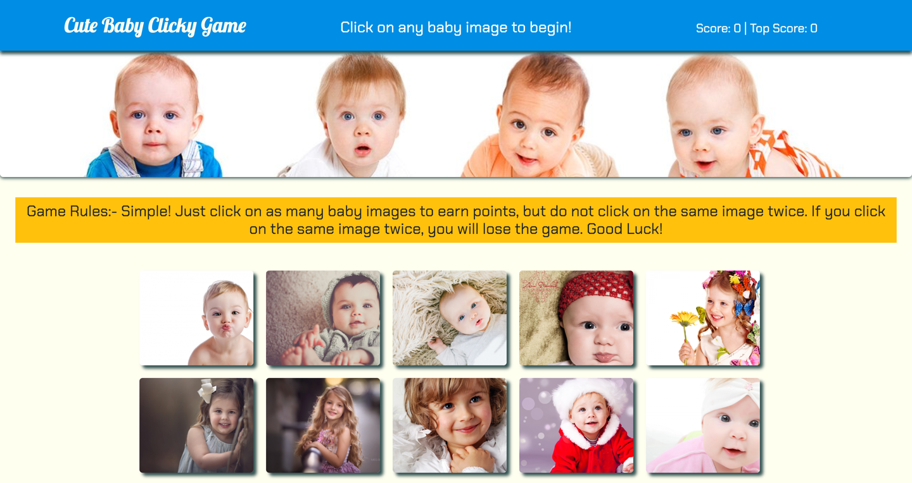

# React Clicky Game!
## Homework 15: `Clicky Game`

### **Creator:** `Amit Singh`

Completed on: July 27th 2019
- - - 

## Description of Application
Clicky Game uses a react app to build a memory based game. 
This game asks the player to click on the images.  Each time an image is clicked, the player will earn a point and the order of the images will randomize.  If an image is selected more than once, the player's score will reset to 0. 

Home Page

- - -
## IMPORTANT LINKS

* [Link to the app hosted on Heroku](https://cute-baby-clicky-game.herokuapp.com/)

* [Link to github repository](https://github.com/amitsinghgh19/clicky-game.git)

* [Link to my Portfolio](https://amitsinghgh19.github.io/Bootstrap-Portfolio/)

- - -
## Technologies Used
- React 
- HTML
- CSS
- Bootstrap
- Javascript
- JQuery
- JSON
- Deployed on Heroku
